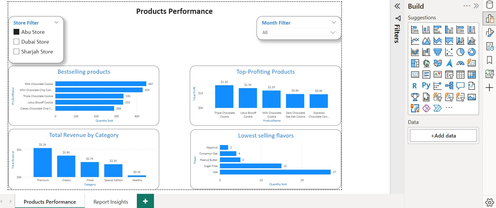
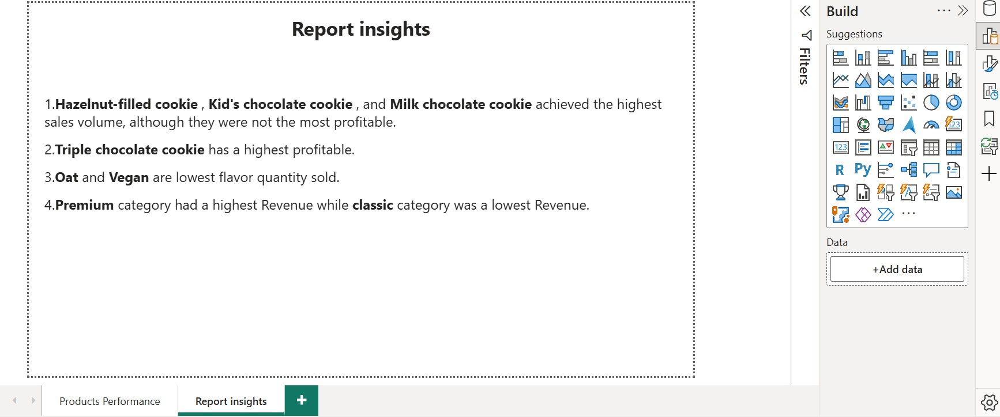
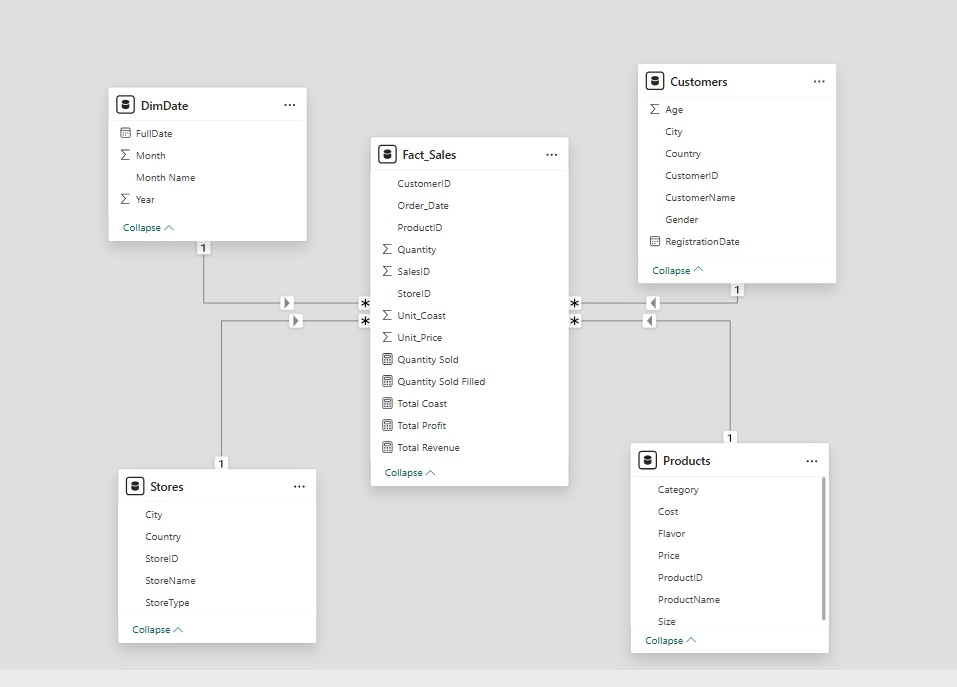

🍪 Cookie Store Product Performance Analysis
📌 Project Overview

This Power BI project analyzes product performance for a cookie store to identify top-selling items, most profitable products, and underperforming categories and flavors. The goal is to support data-driven decisions related to product strategy, pricing, and inventory optimization.

## 🛠 Tools & Skills
- Power BI Desktop
- Power Query
- DAX
- Data Modeling

❓ Business Problem

The cookie store needs clear insights into:

Which products drive the highest sales volume

Which products contribute the most profit

Which flavors and categories are underperforming

🎯 Key Business Questions

What are the top-selling products by quantity?

Which products generate the highest profit?

Which flavors are underperforming?

Which product categories generate the highest and lowest revenue?

🗂️ Data Model

The analysis is built using a star schema consisting of:

Fact_Sales – Sales transactions (quantity, revenue, profit)

Dim_Product – Product details (name, category, flavor)

Dim_Customer – Customer information

Dim_Store – Store locations

Dim_Date – Date dimension for time analysis

## 📂 Dataset
All data tables are included in the `Dataset` folder as an Excel file.

## 📷 Dashboard Preview
Here are screenshots of the dashboard:

## 📦 Full Project
A complete project file is available as a ZIP: `Project.zip`

